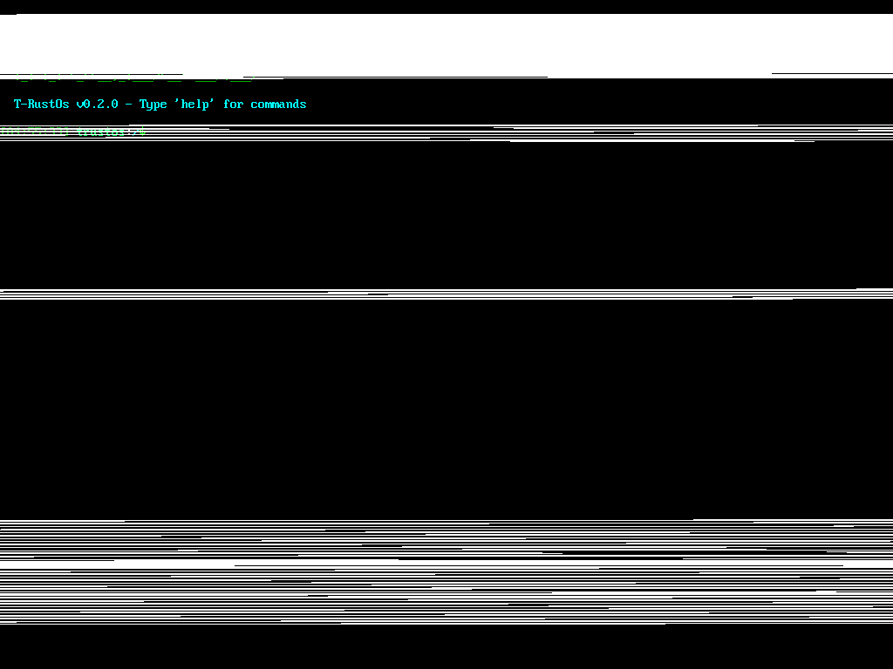

# GPU AMD FONCTIONNEL — TrustOS

---

## Polaris 10 (RX 580X) — SDMA validé sur hardware réel

- **Carte mère** : BTC-250PRO (Skylake, LGA1151)
- **GPU** : AMD RX 580X (Polaris 10, 1002:67DF)
- **SDMA** : RUNNING, ring GART, RPTR/WPTR OK, mapping VRAM/GART conforme Linux
- **Debug** : mapping MMIO, audit complet, test SDMA → succès
- **Capture** : TrustOS Monitor v4, log netconsole, test hardware réel

> Après des semaines de reverse, d’audit et de tests sur hardware, le pipeline SDMA AMD est validé sur TrustOS. RPTR/WPTR OK, ring GART, mapping VRAM/GART, séquence conforme à Linux. 

---

**Prochaine étape :** accélération compute, support CP/graphics, benchs JARVIS sur GPU natif.
