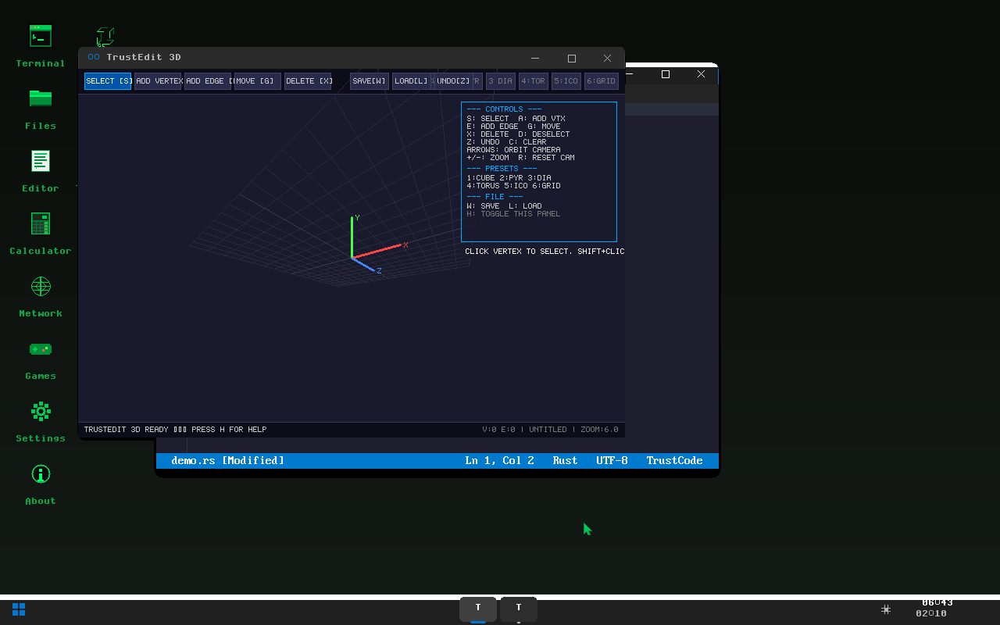

<div align="center">

# 🦀 TrustOS

### **Trust** the code. **Rust** is the reason.

**A fully auditable, bare-metal operating system — 99,000 lines of pure Rust. Zero C. Zero secrets.**

[]()
[]()
[]()
[]()
[]()
[]()
[]()
[](https://github.com/nathan237)

[](https://youtu.be/RBJJi8jW1_g)

[Why "Trust"?](#-why-trustos) · [Features](#-features) · [Quick Start](#-quick-start) · [Architecture](#-architecture) · [Contributing](#-contributing)

---

</div>

## 🔐 Why "TrustOS"?

The name says it all: **Trust** + **Rust**.

In a world where your operating system is a black box — millions of lines of legacy C/C++, binary blobs, proprietary drivers, telemetry you can't disable — **how do you know what your computer is actually doing?**

TrustOS is the answer: **every single line is open, readable, and auditable.**

- 🔍 **Fully auditable** — 99,000 lines of Rust, all on GitHub. No binary blobs. No hidden code.
- 🦀 **Memory safe by design** — Rust's ownership model prevents entire categories of vulnerabilities (buffer overflows, use-after-free, data races).
- 🧩 **Zero dependencies on C** — no libc, no glibc, no C runtime. Every driver, every protocol, every pixel is Rust.
- 📖 **Readable** — one person wrote it in 7 days. If one person can build it, one person can understand it.

> *"The only OS where you can trace every packet, every pixel, and every keystroke back to its source code."*

### Key Stats

| Metric | Value |
|--------|-------|
| **Total code** | 99,000+ lines of Rust |
| **Source files** | 207+ `.rs` files |
| **ISO size** | 6.25 MB |
| **Boot time** | < 1 second |
| **Desktop FPS** | 144 FPS (SSE2 SIMD) |
| **C code** | 0 lines |
| **Development time** | 7 days |

### TrustOS vs The World

| | Traditional OS | TrustOS |
|---|:---:|:---:|
| **Language** | C/C++ with 40 years of memory bugs | 100% Rust — memory safe by design |
| **Codebase** | Millions of lines, impossible to audit | 99K lines, one person can read it all |
| **Binary blobs** | Everywhere | None. Zero. |
| **Telemetry** | Opt-out (maybe) | Doesn't exist — verify it yourself |
| **Build** | Complex cross-compilation toolchains | `cargo build` — that's it |

---

## ✨ Features

### 🖥️ COSMIC2 Desktop Environment
- **Multi-layer GPU compositor** with 8 independent rendering layers
- **SSE2 SIMD optimized** — 144 FPS with zero flickering
- **Taskbar, dock, start menu**, window management, settings panel
- **13 built-in desktop apps**: Terminal, Files, TrustCode, Calculator, Network, Snake Game, Settings, About, TrustGL 3D, TrustBrowser, TrustEdit 3D, and more
- **HoloMatrix 3D backgrounds**: volumetric wireframe scenes (cube, torus, DNA helix, character...)
- **Mouse + keyboard** driven with smooth cursor

### 🌐 TrustBrowser — Built-in Web Browser
- **HTML parser** — renders real web pages
- **CSS engine** — styling and layout
- **JavaScript engine** — basic script execution
- **HTTPS support** — TLS 1.3, handshake written from scratch
- Navigate to real websites from inside the OS

### 📝 TrustCode — Code Editor
- **Rust syntax highlighting** with 60+ keywords
- **Line numbers**, cursor navigation, scrolling
- **File save/load** from TrustFS
- **Bracket matching** and auto-indentation

### 🔤 TrustLang — Programming Language & Compiler
- **Rust-inspired syntax** with functions, recursion, loops, types
- **Full compiler pipeline**: Lexer → Parser → Compiler → Bytecode VM
- **Zero dependencies** — compiles and runs entirely in-kernel
- Commands: `trustlang run`, `trustlang eval`, `trustlang check`

### 🎬 TrustVideo — Real-time Video Engine
- **Custom `.tv` format** with delta + RLE compression
- **Procedural demo engine**: fire, matrix rain, plasma effects
- **60-72 FPS** rendering with integer sine LUT (no floats)
- **RAM backbuffer** + SSE2 swap for instant display

### 🔷 Formula3D — Wireframe 3D Engine
- **Real-time wireframe rendering** with perspective projection
- **Multiple mesh types**: cube, torus, sphere, DNA helix, character model
- **Per-edge coloring** with volumetric low-poly rendering
- **Scanline effects**, gradient backgrounds, floor grids

### 🎨 TrustEdit — 3D Model Editor
- **Wireframe 3D editor** with real-time orbital camera
- **5 editing tools**: Select, Move, Add Vertex, Add Edge, Delete
- **Preset models**: Cube, Pyramid, Diamond, Star, House, Rocket, Tree, Spaceship
- **Save/Load** models in `.t3d` format to TrustFS
- **Undo system** for safe editing
- **Mouse-driven** with toolbar, viewport, and status bar
- Launch with `trustedit` command or from the desktop Start Menu

### 🎮 Interactive Desktop Apps
- **Calculator** — Full arithmetic with chained operations, keyboard & mouse input
- **Snake Game** — Real-time gameplay with arrow keys, scoring, progressive speed
- **TrustBrowser** — Keyboard-driven URL bar, page navigation

### 📁 TrustFS — Persistent Filesystem
- **Block-based storage** with indirect block support
- **Write-Ahead Logging (WAL)** for crash safety
- **Block cache** for performance
- **VFS layer** unifying ramfs, procfs, devfs, FAT32, and TrustFS

### 🌐 Network Stack (from scratch)
- **VirtIO-net** driver with full packet handling
- **TCP/IP** stack: ARP, DHCP, DNS, TCP, UDP, ICMP
- **TLS 1.3** — full handshake, X.509 certificate validation, crypto
- **HTTP/HTTPS client** — `curl`, `wget`, `browse`
- **Commands**: `ping`, `nslookup`, `traceroute`, `netstat`, `arp`, `route`, `ifconfig`

### 🐧 Linux Compatibility Layer
- **100+ syscalls** emulated (read, write, mmap, fork, exec...)
- **ELF binary loader** — run Linux binaries directly
- **Alpine Linux subsystem** — `apk` package manager support
- **Binary-to-Rust transpiler** — analyze and decompile Linux binaries

### 🛡️ Security & Auth
- **Capability-based** security model
- **User authentication**: login, su, passwd, adduser
- **File permissions**: chmod, chown
- **Process isolation** with Ring 0/3 separation

### ⚡ Hypervisor
- **Intel VT-x (VMX)** and **AMD-V (SVM)** support
- **Extended Page Tables (EPT)**, VMCS, VPID
- **Guest VM isolation** for running Linux subsystem

### ⚡ Performance
- **SSE2 SIMD** throughout: buffer fills, blits, compositing
- **Double-buffered** rendering (RAM backbuffer → MMIO swap)
- **SMP multi-core** support
- **Compile-time LUTs** for math-heavy rendering

---

## 🚀 Quick Start

### Prerequisites
- Rust nightly (`rustup` will auto-install via `rust-toolchain.toml`)
- QEMU with OVMF (UEFI firmware)
- `xorriso` (for ISO creation)

### Build & Run

```bash
# Clone
git clone https://github.com/nathan237/TrustOS.git
cd TrustOS

# Build kernel
cargo build --release -p trustos_kernel

# Create ISO
cp target/x86_64-unknown-none/release/trustos_kernel iso_root/boot/
xorriso -as mkisofs -b boot/limine/limine-bios-cd.bin \
  -no-emul-boot -boot-load-size 4 -boot-info-table \
  --efi-boot boot/limine/limine-uefi-cd.bin \
  -efi-boot-part --efi-boot-image --protective-msdos-label \
  iso_root -o trustos.iso
./limine/limine bios-install trustos.iso

# Run
qemu-system-x86_64 \
  -cdrom trustos.iso \
  -m 256M -machine q35 -smp 4 \
  -display gtk -vga std \
  -device virtio-gpu-pci \
  -device virtio-net-pci,netdev=net0 \
  -netdev user,id=net0 \
  -drive "if=pflash,format=raw,file=OVMF.fd" \
  -serial stdio
```

### Windows (PowerShell)
```powershell
cargo build --release -p trustos_kernel
.\run-qemu.ps1
```

---

## 📸 Screenshots

### COSMIC2 Desktop with Interactive Apps


### Shell with 200+ Commands
```
  _____ ____            _    ___      
 |_   _|  _ \ _   _ ___| |_ / _ \ ___ 
   | | | |_) | | | / __| __| | | / __|
   | | |  _ <| |_| \__ \ |_| |_| \__ \
   |_| |_| \_\\__,_|___/\__|\___/|___/

[14:32:15] trustos:/$ showcase
```

> **Tip**: Run `showcase` to see an automated demo of all features — perfect for screen recording!

### Available Demo Commands
| Command | Description |
|---------|-------------|
| `showcase` | Full automated feature tour (for video) |
| `showcase fast` | Quick version |
| `showcase slow` | Extended version with longer pauses |
| `desktop` | Launch COSMIC2 desktop environment |
| `video demo fire` | Real-time fire effect |
| `video demo matrix` | Matrix digital rain |
| `video demo plasma` | Psychedelic plasma |
| `trustlang demo` | TrustLang compiler demo |
| `benchmark` | GPU/SIMD performance benchmarks |
| `neofetch` | System info display |
| `trustedit` | Launch TrustEdit 3D model editor |

---

## 📋 200+ Built-in Commands

<details>
<summary><strong>📁 Filesystem (25+)</strong></summary>

`ls` `cd` `pwd` `mkdir` `rmdir` `touch` `rm` `cp` `mv` `cat` `head` `tail` `wc` `stat` `tree` `find` `grep` `ln` `readlink` `chmod` `chown` `sort` `uniq` `cut` `diff`
</details>

<details>
<summary><strong>🌐 Network (15+)</strong></summary>

`ifconfig` `ping` `curl` `wget` `nslookup` `arp` `route` `netstat` `traceroute` `browse` `download` `httpget` `tcpsyn` `ip` `dig`
</details>

<details>
<summary><strong>⚙️ System (25+)</strong></summary>

`ps` `top` `free` `df` `uname` `dmesg` `mount` `umount` `lspci` `lscpu` `lsblk` `lsmem` `lsusb` `lsmod` `lshw` `vmstat` `iostat` `sysctl` `kill` `killall` `nice` `bg` `fg` `strace` `lsof`
</details>

<details>
<summary><strong>👤 Users & Security (10+)</strong></summary>

`login` `logout` `su` `passwd` `adduser` `deluser` `users` `whoami` `id` `chmod` `chown`
</details>

<details>
<summary><strong>🎨 Graphics & Media (10+)</strong></summary>

`desktop` `video` `benchmark` `holo` `matrix` `imgview` `imgdemo` `gterm` `theme` `fontsmooth`
</details>

<details>
<summary><strong>🛠️ Development (10+)</strong></summary>

`trustlang` `transpile` `exec` `elfinfo` `hexdump` `strings` `base64` `md5sum` `sha256sum` `od`
</details>

<details>
<summary><strong>📦 Archives & Compression</strong></summary>

`tar` `gzip` `gunzip` `zip` `unzip`
</details>

---

## 🏗️ Architecture

```
┌─────────────────────────────────────────────────────────────┐
│                     Applications                            │
│  TrustCode · TrustLang · TrustBrowser · Games · Terminal    │
├─────────────────────────────────────────────────────────────┤
│              COSMIC2 Desktop Compositor                     │
│     8-layer GPU compositing · SSE2 SIMD · 144 FPS          │
├──────────┬──────────┬───────────┬──────────┬────────────────┤
│  VFS     │ Network  │  Linux    │ Graphics │  TrustVideo    │
│  ramfs   │ TCP/IP   │ Subsystem │ TrustGL  │  Codec +       │
│  procfs  │ TLS 1.3  │ 100+     │ Raytrace │  Procedural    │
│  devfs   │ DHCP/DNS │ syscalls  │ 3D Mesh  │  Renderer      │
│  TrustFS │ VirtIO   │ ELF      │ Formula  │  Fire/Plasma   │
│  FAT32   │ HTTP/S   │ Alpine   │ HoloMat  │  Matrix Rain   │
├──────────┴──────────┴───────────┴──────────┴────────────────┤
│                    TrustOS Kernel                           │
│  Memory · Scheduler · IPC · Security · Drivers · Syscalls  │
│  SSE2 SIMD · SMP Multi-core · Hypervisor (VT-x/SVM)       │
├─────────────────────────────────────────────────────────────┤
│              Hardware (x86_64 · UEFI · VirtIO)              │
│              Limine Bootloader · MMIO · PCI                 │
└─────────────────────────────────────────────────────────────┘
```

### Module Breakdown

| Module | Lines | Description |
|--------|-------|-------------|
| `shell.rs` | ~14,000 | Command interpreter, 200+ commands, cinematic showcase |
| `network/` | ~5,000 | Full TCP/IP stack with TLS 1.3, HTTPS |
| `graphics/` | ~4,000 | HoloMatrix, raytracer, 3D mesh, OpenGL emu |
| `compositor/` | ~3,000 | Multi-layer GPU compositor |
| `browser/` | ~2,500 | HTML/CSS parser, JS engine, page renderer |
| `linux/` | ~3,000 | Linux syscall emulation, ELF loader |
| `trustlang/` | ~2,000 | Compiler + bytecode VM |
| `formula3d.rs` | ~1,500 | Wireframe 3D engine with per-edge colors |
| `model_editor.rs` | ~750 | TrustEdit 3D wireframe model editor |
| `video/` | ~1,500 | TrustVideo codec & player |
| `framebuffer/` | ~1,500 | SSE2 SIMD rendering |
| `filesystem/` | ~2,000 | TrustFS with WAL, VFS, FAT32 |
| `hypervisor/` | ~2,000 | VT-x/SVM, EPT, guest VM isolation |
| `tls13/` | ~2,000 | TLS 1.3, crypto, X.509 certs |

---

## 🎬 Create a Demo Video

TrustOS includes a built-in `showcase` command that automates a complete feature tour:

```bash
# Boot TrustOS, then type:
showcase          # Normal speed (~90 seconds)
showcase fast     # Quick demo (~45 seconds)  
showcase slow     # Extended demo (~3 minutes)
```

The showcase runs through:
1. **Cinematic intro** — 5 Matrix-style scenes with typed text & rain effects
2. **System info** — neofetch, uname, memory stats
3. **Filesystem** — create files, directory tree
4. **TrustLang** — compile & run a Fibonacci program live
5. **Network** — interface config, connection status
6. **Video effects** — fire, matrix rain, plasma (full-screen, auto-timed)
7. **Formula3D** — real-time wireframe 3D character with per-edge colors
8. **COSMIC2 Desktop + TrustBrowser** — desktop auto-demo with web browsing
9. **Command overview** — 200+ commands categorized

> Film it with OBS or any screen recorder for instant marketing content!

---

## 🤝 Contributing

Contributions are welcome! TrustOS is designed to be **readable and hackable**.

### Good First Issues
- Add a new shell command (follow the pattern in `shell.rs`)
- Add a new TrustLang built-in function
- Create a new HoloMatrix 3D scene
- Add a new TrustVideo procedural effect
- Improve the desktop UI (new widgets, themes)

### How to Contribute

```bash
# Fork, then:
git clone https://github.com/YOUR_USERNAME/TrustOS.git
git checkout -b feature/my-feature

# Make changes, build & test
cargo build --release -p trustos_kernel
# Run in QEMU to test

git commit -m "Add my feature"
git push origin feature/my-feature
# Open a Pull Request
```

### Project Structure
```
kernel/src/
├── main.rs              # Kernel entry point
├── shell.rs             # Shell + 200+ commands + showcase
├── desktop.rs           # COSMIC2 desktop manager
├── model_editor.rs      # TrustEdit 3D model editor
├── formula3d.rs         # Wireframe 3D engine
├── compositor/          # 8-layer GPU compositor
├── browser/             # HTML/CSS/JS browser engine
├── network/             # TCP/IP, DHCP, DNS
├── tls13/               # TLS 1.3, crypto, X.509
├── video/               # TrustVideo codec
├── trustlang/           # Compiler + VM
├── framebuffer/         # SSE2 SIMD rendering
├── graphics/            # 3D, raytracer, HoloMatrix
├── hypervisor/          # VT-x/SVM, EPT, guest VMs
├── vfs/                 # TrustFS, FAT32, procfs, devfs
├── linux_compat/        # 100+ Linux syscalls
├── drivers/             # AHCI, USB, VirtIO, input
└── security/            # Capability model, auth
```

---

## 📊 Comparison

| Feature | TrustOS | Linux 0.01 (1991) | MenuetOS | SerenityOS |
|---------|---------|-------------------|----------|------------|
| Language | **Rust** | C | ASM | C++ |
| Lines of code | 99K | 10K | 40K | 800K+ |
| ISO size | **6.25 MB** | N/A | 1.44 MB | ~300 MB |
| Dev time | **7 days** | 6 months | Years | Years |
| GUI Desktop | Yes (144 FPS) | No | Yes | Yes |
| Web Browser | **Yes** (HTML/CSS/JS) | No | No | Yes |
| Built-in compiler | **Yes** (TrustLang) | No | No | No |
| 3D Engine | **Yes** (Formula3D) | No | No | No |
| Network + TLS 1.3 | **Yes** | No | No | Yes |
| Hypervisor | **Yes** (VT-x/SVM) | No | No | No |
| Memory safe | **Yes** (Rust) | No | No | No |
| Fully auditable | **Yes** | Partially | Yes | Partially |

---

## � Changelog

### v0.1.1 — June 2025
- **TrustEdit 3D Model Editor** — New wireframe 3D editor with 5 tools, 8 presets, save/load `.t3d`, undo system
- **Interactive Calculator** — Full arithmetic with keyboard & mouse, chained operations
- **Interactive Snake Game** — Real-time gameplay with arrow keys, scoring, speed progression
- **Browser keyboard input** — Type URLs, navigate, clear with Escape
- **Start Menu fix** — All 13 pinned apps now clickable and functional
- **`trustedit` shell command** — Launch TrustEdit directly from the shell
- **Desktop stability** — Fixed dual start menu conflict, improved window management

### v0.1.0 — June 2025
- Initial release: 99K+ lines, 207+ files, full desktop, shell, browser, network, TrustLang, hypervisor

---

## �📄 License

MIT License — see [LICENSE](LICENSE) for details.

---

## 🙏 Acknowledgments

- [Limine](https://github.com/limine-bootloader/limine) — Bootloader
- [Rust OSDev](https://os.phil-opp.com/) — Inspiration
- [Alpine Linux](https://alpinelinux.org/) — Linux subsystem base

---

## 👤 Author

**Nated0ge** — Sole creator & developer of TrustOS

- GitHub: [@nathan237](https://github.com/nathan237)
- Project: [TrustOS](https://github.com/nathan237/TrustOS)

> Every line of TrustOS — 99,000+ lines of Rust — was designed, written, and tested by a single developer in 7 days.

---

<div align="center">

**Trust** the code. **Rust** is the reason.

Created with ❤️ by [Nated0ge](https://github.com/nathan237)

99,000 lines · 7 days · Zero C · Fully auditable

⭐ **Star this repo** if you believe in transparent, auditable operating systems.

[Report Bug](https://github.com/nathan237/TrustOS/issues) · [Request Feature](https://github.com/nathan237/TrustOS/issues) · [Watch Demo](https://youtu.be/RBJJi8jW1_g)

</div>
