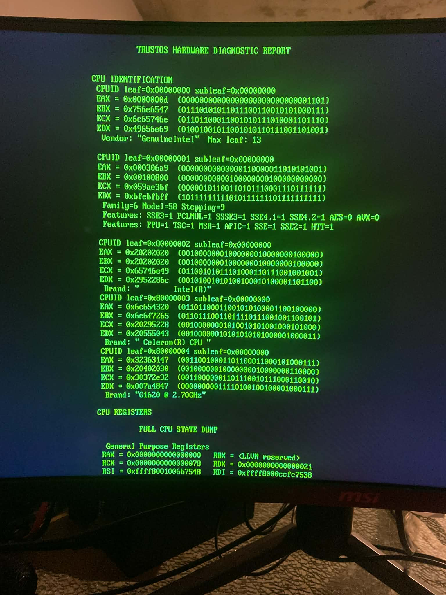
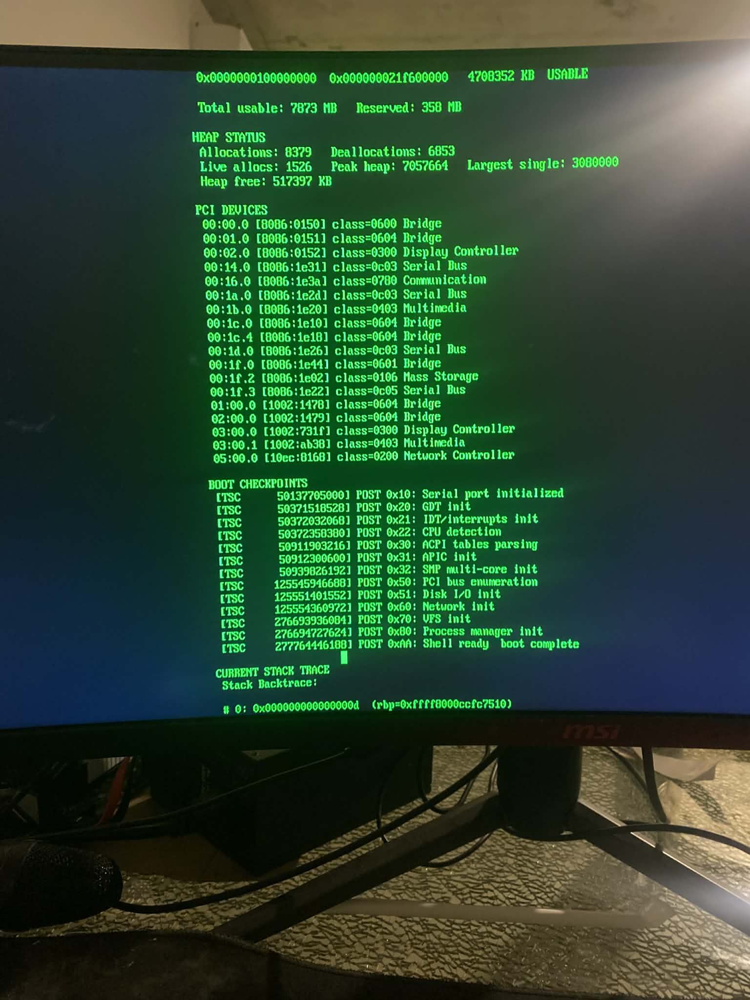
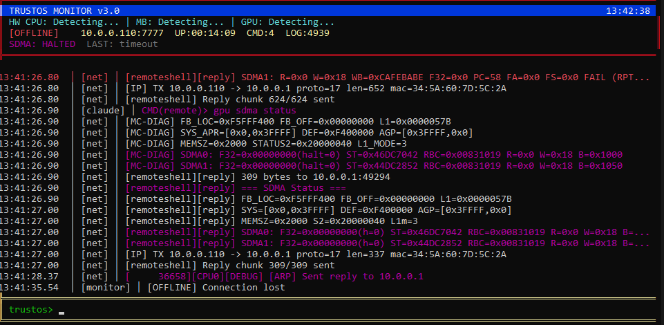

<div align="center">


# TrustOS

### Boot on any hardware. Debug everything.

**A bare-metal OS written entirely in Rust — zero C, zero binary blobs, zero secrets.**
**Designed to run on real hardware and tell you exactly what's happening inside it.**

[]()
[]()
[]()
[]()
[](LICENSE)
[](https://github.com/nathan237)

---

</div>

## What is TrustOS?

TrustOS is a bare-metal operating system that boots directly on real hardware — no Linux, no BIOS services, no runtime dependencies. Once running, it gives you complete visibility into your machine: every PCI device, every CPU register, every GPU engine, every ACPI table, every DIMM slot.

The core use case: **boot on any x86_64 machine (USB or PXE), and get a full hardware diagnostic report in seconds — remotely, over the network.**

It ships with a Python remote monitor (`scripts/remote_screen.py`) that lets you see the screen and interact with the shell from any PC on the same network — no physical access required.

---

## 🔥 Work in Progress — AMD GPU Bare-Metal Driver

We're building a **from-scratch AMD GPU driver** in pure `no_std` Rust — no Linux, no Mesa, no libdrm. Direct MMIO register control on real silicon.

**Hardware**: AMD RX 580X (Polaris 10, `1002:67DF`, 8 GB GDDR5) on a BTC-250PRO mining board via PCIe riser. All debugging done **headless** — UDP shell + netconsole + PXE reboot. No monitor, no keyboard.

### Milestones

| What | Status | Proof |
|------|--------|-------|
| PCI enumeration & BAR decode | ✅ | GPU found, 6 BARs mapped (VRAM 256 MB, MMIO 512 KB, Doorbell 2 MB) |
| MMIO register access | ✅ | Direct BAR5 reads/writes validated against Linux amdgpu source |
| VRAM detection | ✅ | 8 GB GDDR5 from CONFIG_MEMSIZE, FB_LOCATION physical range parsed |
| Graphics Memory Controller | ✅ | L1/L2 TLB, system aperture, VM flat mode, TLB invalidation |
| Firmware loading | ✅ | SDMA0/1, PFP, ME, MEC microcode loaded via MMIO (no PSP on Polaris) |
| SDMA ring buffer | ✅ | Ring allocated, firmware alive — IP_BUSY toggles confirm |
| PSP bootstrap (Navi) | 🔧 | Bootloader protocol scaffolded (SOS, GPCOM, TMR) — needs real Navi HW |
| Compute dispatch | 🔧 | PM4 packets + HQD init ready, pending ring validation |
| GPU-accelerated AI | 📋 | INT8 GEMM (`V_DOT4_I32_I8`) across 36 CUs for JARVIS training |

### Key Discovery

After **14+ debug iterations**, the SDMA read pointer was stuck at 0. We systematically eliminated: PCIe riser effects, VT-d passthrough, doorbell ordering, HDP flush timing, VMID field widths, SAM bit positions, and more.

**Root cause**: the Graphics Memory Controller was never initialized — L1 TLB had system-access-mode disabled, so firmware couldn't resolve ring buffer addresses. Not a register bug, not a PCIe issue — it was the memory subsystem.

### Goal

Train JARVIS (4.4M-param byte-level transformer embedded in the kernel) directly on GPU compute units. No CPU fallback for matrix ops.

---

## Hardware Debug Capabilities

TrustOS probes hardware at the register level. No abstraction layers between you and the silicon.

| Module | What it reads |
|--------|--------------|
| **PCI Bus** | Full enumeration: vendor/device IDs, class, BARs, capability chains (MSI, PCIe, PM), bus mastering |
| **CPU** | CPUID all leaves, brand string, feature flags (SSE/AVX/AES), family/model/stepping, MSR scan |
| **SMBIOS/DMI** | Board manufacturer, BIOS version, DIMM slots (size/speed/type), chassis, serials |
| **ACPI** | RSDP → XSDT walk, all tables (MADT, FADT, HPET, MCFG, SSDT), raw hex dump |
| **AMD GPU** | MMIO registers, GRBM status, SDMA engine state, VRAM size, memory controller config |
| **NVIDIA GPU** | PMC/PBUS registers, GPU identity, diagnostic dump |
| **Memory Map** | Full UEFI memory map: type, physical range, page count |
| **Boot Timing** | TSC-based per-subsystem boot profiling (µs precision) |
| **Network** | NIC detection, MAC address, PCI config |
| **Storage** | NVMe/AHCI controller detection, BAR decode |

**Running on real hardware (Intel G4400 + AMD RX 580X, BTC-250PRO LR):**



*CPUID full decode, CPU registers dump — bare-metal framebuffer output.*



*PCI bus enumeration with AMD GPU + RTL8168 detected, heap status, and TSC boot checkpoints.*

---

## Build Your Own Tools

TrustOS gives you **direct register access** and a **shell framework**. From there — you build whatever diagnostics you need.

The project ships the primitives, not a fixed toolkit:

- **MMIO helpers** — Read/write any GPU register by offset. BAR mapping is done for you.
- **PCI config space** — Full access to any device: config registers, capability chains, BAR decode.
- **Shell commands** — Add a command in `kernel/src/shell/`, it's live at next boot.
- **Netconsole** — Every `serial_println!()` streams to UDP 6666. Pipe debug output to any host.
- **Remote shell** — Commands via UDP 7777. Automate with Python scripts.
- **PXE boot** — Edit → rebuild → copy to TFTP → remote reboot. Full cycle under 60 seconds.

**Example** — probe a GPU register:

```rust
// In your shell command handler:
let mmio = gpu_state.mmio_base; // Already mapped
let val = unsafe { core::ptr::read_volatile((mmio + 0x2004) as *const u32) };
serial_println!("GRBM_STATUS2: {:#010x}", val);
```

No ioctl, no syscall, no permission model — you're in ring 0, talking to silicon.

We built our own GPU diagnostic toolkit this way during the RX 580X bring-up. You can build yours for any hardware TrustOS sees.

---

## Remote Monitor

TrustOS streams its framebuffer over UDP and accepts shell commands remotely:

- **UDP 7779** — Screencap (chunked SCRN protocol)
- **UDP 7777** — Remote shell
- **UDP 6666** — Netconsole (kernel debug output)

Debug headless machines — no monitor, no keyboard, just Ethernet.

```bash
python scripts/remote_screen.py --ip 10.0.0.110 --interval 2
```



*Monitor v3.0 — AMD GPU init streamed over UDP netconsole in real time.*

---

## Quick Start

### QEMU (30 seconds)

```bash
qemu-system-x86_64 -cdrom trustos.iso -m 512M -cpu max -smp 4 \
  -display gtk -vga std -serial stdio \
  -netdev user,id=net0 -device rtl8139,netdev=net0
```

Type `help` for all commands. `hwdbg auto` dumps CPU + memory + PCI + SMBIOS in one shot.

### Bare Metal (USB)

1. Download ISO from [**Releases**](https://github.com/nathan237/TrustOS/releases)
2. Flash with [**Rufus**](https://rufus.ie/) → **DD Image mode**
3. Boot (F12 / DEL). Works on **UEFI** and **Legacy BIOS**.

### PXE Network Boot

```bash
python scripts/pxe_server.py --tftp-root pxe_tftp --server-ip 10.0.0.1
```

---

## Platform Support

| Target | Method | Status |
|--------|--------|--------|
| x86_64 PC (USB/ISO) | Limine hybrid (UEFI + Legacy BIOS) | **Production** |
| PXE network boot | TFTP + DHCP auto-config | **Working** |
| QEMU / VirtualBox | VM | **Production** |
| ARM64 | `fastboot flash boot` / SD card | Experimental |
| RISC-V | OpenSBI + U-Boot | WIP |

Tested on: ThinkPad T61, BTC-250PRO LR (mining board), QEMU/VirtualBox.

---

## Project Structure

```
TrustOS/
  kernel/src/
    main.rs           — Entry point (Limine boot protocol)
    drivers/           — AMD GPU (Polaris/Navi), NVIDIA, RTL8139/8169, AHCI, XHCI
    netstack/          — TCP/IP, UDP, ARP, DHCP, DNS, IPv6
    memory/            — Physical frame allocator, paging, heap
    interrupts/        — IDT, APIC, exception handlers
    shell/             — 200+ commands (hwdbg, pci, gpu, sensors, etc.)
    jarvis/            — JARVIS AI (4.4M-param transformer, guardian system)
    framebuffer/       — Rendering, POST codes
    scheduler/         — Process scheduler
    vfs/               — Virtual filesystem
  scripts/
    remote_screen.py   — Remote monitor (screencap + input injection)
    pxe_server.py      — DHCP + TFTP for PXE boot
```

---

## Build

```powershell
cargo build --release -p trustos_kernel    # Build kernel
.\trustos.ps1 build                         # Build + ISO + VM
.\trustos.ps1 build -NoRun                  # Build + ISO only
```

Requires: Rust nightly, `x86_64-unknown-none` target, `llvm-tools-preview`.

---

## Changelog

### v0.10.8 — AMD GPU Memory Controller & SDMA Bring-up (April 5, 2026)

- **GMC init** — Full Polaris Graphics Memory Controller: L1/L2 TLB, system aperture, VM flat mode. Root cause of SDMA hang identified and fixed.
- **SDMA engine alive** — Ring buffer operational on real hardware (RX 580X). Firmware responsive.
- **14+ debug iterations** — Systematic elimination on real hardware: PCIe, TLB, doorbell, HDP, VMID.
- **Compute pipeline** — PM4 packet builders, hardware queue descriptors, shader agent framework.
- **Remote GPU bring-up** — Entire driver development done headless via UDP + PXE.

### v0.10.7 — AMD PSP Driver & Boot Timing (March 25, 2026)

- **PSP driver** — Platform Security Processor bootloader interface for Navi10 GPUs.
- **Firmware pipeline** — Polaris direct MMIO path, Navi10 PSP path, staged init.
- **Boot timing** — TSC-based `boot_timing!` macro, µs precision per subsystem.

### v0.10.6 — Remote Desktop & Hardware Drivers (March 24, 2026)

- **Remote desktop** — Input injection, screencap streaming, remote ACPI reboot.
- **NIC drivers** — RTL8139/RTL8169 rewritten, hardware-tested.
- **Visual POST codes** — Boot progress on framebuffer.
- **GPU init hardening** — Deferred init prevents network driver conflicts.

### v0.10.5 — Hypervisor & Userland (March 20, 2026)

- **AMD SVM** — VMCB, NPT, unified backend with Intel VT-x.
- **Ring 3 userland** — 104 Linux-compatible syscalls, ELF64 loader, COW fork, signals, pipes.
- **VirtIO** — Stable virtio-blk and virtio-console.

---

## License

Apache 2.0 — see [LICENSE](LICENSE).

---

## AI Disclosure

This project was built with AI assistance (GitHub Copilot). All code is reviewed and understood by the author. No generated code is shipped without verification.
