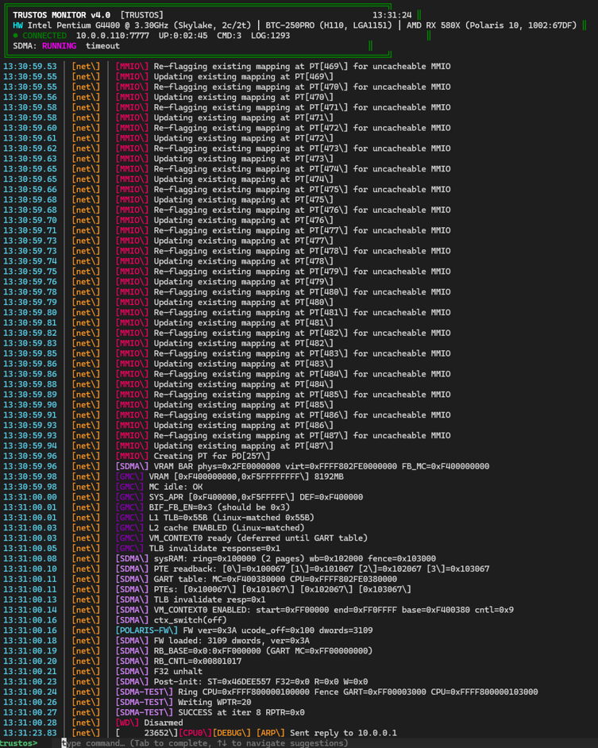
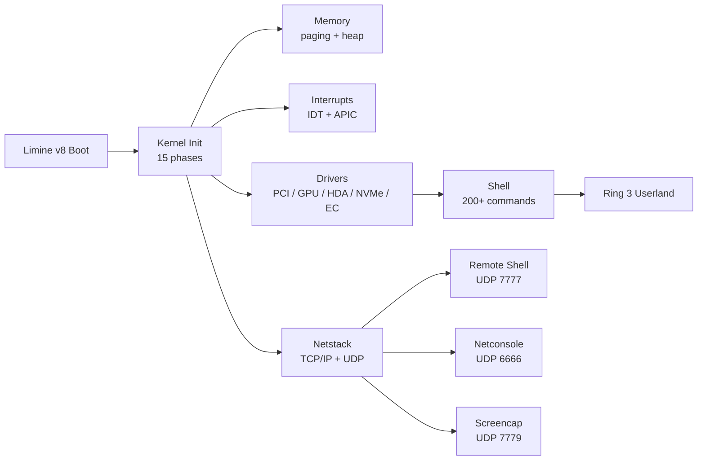

<div align="center">


# TrustOS

### A bare-metal OS in Rust that boots on real hardware and tells you exactly what's inside the silicon.

[](https://github.com/nathan237/TrustOS/actions/workflows/ci.yml)
[]()
[]()
[](LICENSE)
[](https://github.com/nathan237/TrustOS/releases)
[](https://github.com/sponsors/nathan237)

</div>

---

## Why TrustOS?

- **🦀 100% Rust, `no_std`** — zero C, zero binary blobs, `unsafe` only at MMIO boundaries.
- **🔬 Hardware X-Ray** — every PCI device, MSR, ACPI table, GPU register readable at boot. No Linux, no Mesa, no abstraction.
- **🌐 Remote-first** — framebuffer streamed over UDP, shell over UDP, kernel logs over UDP. Debug headless boards from any laptop.
- **🛠️ Built solo** — one developer, one vision, no committee.

➡️ See the public [**ROADMAP**](ROADMAP.md) for what's next.

---

## What's new — v0.12.0 "Audio Edition" (April 2026)

TrustOS ships its first **music-focused edition**: a bare-metal `no_std` audio stack with synthesizer, DAW, sequencer, live coding, and a stack of effects — all running directly on hardware, no Linux, no PulseAudio, no JACK.

→ Download: [**`trustos-audio.iso`**](https://github.com/nathan237/TrustOS/releases/latest) (Releases page) — boots on real hardware via USB (Rufus / DD mode) or QEMU.

### What's inside the Audio Edition

- **Intel HDA driver** — `no_std`, CORB/RIRB, codec discovery, BDL DMA, 48 kHz / 16-bit stereo. Tested on ThinkPad T61 (AD1984).
- **TrustSynth** — polyphonic synthesizer engine
  - 5 waveforms: **sine, square, saw, triangle, noise**
  - Q16.16 phase accumulator (no FP — pure integer DSP)
  - Up to **8 simultaneous voices**
  - Full **ADSR envelope** + presets (organ, pluck, pad)
  - 128-note MIDI mapping, analog-style pitch micro-drift LFO
- **Effects rack** (all `no_std`, integer DSP)
  - **Chamberlin SVF filter** — LP / HP / BP with resonance
  - **Delay** (echo)
  - **Distortion** (saturation / clipping)
  - **Tremolo** (volume LFO)
  - **Vibrato** (pitch LFO)
  - **Volume / gain / fade in-out**
- **Pattern Sequencer** — 16 patterns × 64 steps, BPM 60–300, loop playback with visual feedback.
- **TrustDAW** — full Digital Audio Workstation in the kernel
  - Multi-track with **solo / mute / volume / pan**
  - **Piano Roll** GUI with on-screen keyboard
  - **PS/2 keyboard → MIDI** input mapping
  - **Real-time recording**, transport controls (play / stop / rec / loop)
  - **Beat Studio** grid sequencer
  - **WAV export** to VFS
  - Live **audio visualizer** + spectrum / VU meter
  - 480 PPQN MIDI timing
- **Strudel / TidalCycles live coding** — mini-notation parser
  - `c4 e4 g4` sequences, `[e4 g4]` sub-groups, `*3` repeats, `.` rests
  - ~60 drum aliases (`bd`, `sd`, `hh`, `cp`, `kick`, `snare`, `hihat`, …)

### Shell commands

| Command | What it does |
|---|---|
| `beep [freq] [ms]` | One-shot tone (default 440 Hz / 500 ms) |
| `audio [init\|status\|stop\|test]` | HDA driver control |
| `synth note <C4> [ms]` | Play a note through TrustSynth |
| `synth wave <sine\|square\|saw\|tri\|noise>` | Switch waveform |
| `synth adsr <a> <d> <s> <r>` | Set envelope |
| `synth preset <organ\|pluck\|pad>` | Load preset |
| `synth demo` | Scale + showcase demo |
| `live <pattern>` | Strudel-style live coding |
| `daw demo \| play \| record \| mixer \| export <file>` | TrustDAW control |
| `vizfx` | Live audio visualizer |

### Build it yourself

```powershell
.\scripts\build\build-trustos-edition.ps1 -Edition audio -NoRun
# → builds\trustos-audio\trustos-audio.iso
```

→ Devlog: [`docs/AUDIO_SYNTH_ROADMAP.md`](docs/AUDIO_SYNTH_ROADMAP.md)

---

## Previously — v0.11.0 (April 2026)

Bare-metal AMD GPU bring-up, working audio on real laptops, protected userland, and a full hardware diagnostics suite.

### AMD GPU SDMA validated on real silicon

<div align="center">

</div>

From-scratch AMD driver in pure `no_std` Rust on an RX 580X (Polaris 10). Ring buffer in GART, firmware responsive, RPTR/WPTR advancing. Root cause of the 14-iteration debug saga: the **Graphics Memory Controller** (L1/L2 TLB, system aperture, VM flat mode) was uninitialized — the SDMA firmware couldn't resolve ring addresses. Not the registers, not the PCIe link — the memory subsystem.

→ Devlog: [`docs/devlog/gpu_amd_sdma_milestone.md`](docs/devlog/gpu_amd_sdma_milestone.md)

### Other wins this cycle

- **Intel HDA audio** — complete `no_std` driver, working sound on ThinkPad T61 / AD1984 codec
- **Ring 3 userland** — protected user-mode processes, 85-check conformance audit
- **Hardware diagnostics** — 6 new modules: `pciraw`, `regdiff`, `ioscan`, `regwatch`, `aer`, `timing` (15+ `hwdbg` subcommands total)
- **ThinkPad EC** — fan/thermal/battery readout + CPU frequency scaling via MSR
- **CoreMark** — 25,000 iter/sec on bare metal Intel G4400 ([`docs/BENCHMARK.md`](docs/BENCHMARK.md))
- **Security audit** — preemptive cross-OS vulnerability sweep

→ Full history: [`CHANGELOG.md`](CHANGELOG.md)

---

## Architecture at a glance


```mermaid
flowchart LR
    A[Limine v8 Boot] --> B[Kernel Init<br/>15 phases]
    B --> C[Memory<br/>paging + heap]
    B --> D[Interrupts<br/>IDT + APIC]
    B --> E[Drivers<br/>PCI / GPU / HDA / NVMe / EC]
    B --> F[Netstack<br/>TCP/IP + UDP]
    E --> G[Shell<br/>200+ commands]
    F --> H[Remote Shell<br/>UDP 7777]
    F --> I[Netconsole<br/>UDP 6666]
    F --> J[Screencap<br/>UDP 7779]
    G --> L[Ring 3 Userland]
```

---

## How does it compare?

| Project | Lang | `no_std` kernel | Bare-metal GPU bring-up | Remote UDP shell | Solo dev |
|---|---|---|---|---|---|
| **TrustOS** | Rust | ✅ | ✅ AMD Polaris from scratch | ✅ | ✅ |
| Redox OS | Rust | partial (microkernel) | ❌ (uses Linux drivers via patch) | ❌ | ❌ (team) |
| Theseus | Rust | ✅ | ❌ | ❌ | research |
| SerenityOS | C++ | ❌ | partial | ❌ | ❌ (team) |
| Hubris | Rust | ✅ | embedded only | ❌ | ❌ (Oxide) |
| seL4 | C | ✅ | ❌ | ❌ | ❌ |

TrustOS is not trying to replace any of these. The angle is different: **boot anywhere, see everything, debug it remotely.**

---

## Hardware probe surface

| Subsystem | What you get |
|-----------|--------------|
| **PCI / PCIe** | Full enum, BAR decode, capability chains, MSI/PCIe-PM, AER decode |
| **CPU** | All CPUID leaves, MSRs, family/model/stepping, AVX/SSE/AES feature flags |
| **SMBIOS / DMI** | Board, BIOS, DIMM (size/speed/type), chassis, serials |
| **ACPI** | RSDP → XSDT walk, MADT/FADT/HPET/MCFG/SSDT, raw hex |
| **AMD GPU** | MMIO, GRBM, SDMA state, GMC/VM, VRAM, doorbells |
| **NVIDIA GPU** | PMC/PBUS regs, GPU identity |
| **Intel HDA** | Codec tree, widgets, amp caps, pin config |
| **ThinkPad EC** | Fans, thermals, battery, EC regs |
| **Memory map** | Full UEFI map: type, range, page count |
| **Boot timing** | TSC per-subsystem checkpoints (µs precision) |
| **Network / Storage** | NIC enum + MAC, NVMe/AHCI BAR decode |


---

## Remote monitor

```bash
python scripts/remote_screen.py --ip 10.0.0.111 --interval 2
```

- **UDP 7779** — framebuffer screencap (chunked SCRN protocol)
- **UDP 7777** — remote shell
- **UDP 6666** — netconsole (kernel debug output)


---

## Quick start

### QEMU
```bash
qemu-system-x86_64 -cdrom trustos.iso -m 512M -cpu max -smp 4 \
  -display gtk -vga std -serial stdio \
  -netdev user,id=net0 -device rtl8139,netdev=net0
```
Then type `help`. `hwdbg auto` dumps CPU + memory + PCI + SMBIOS.

### USB
1. Grab an ISO from [**Releases**](https://github.com/nathan237/TrustOS/releases).
2. Flash with [**Rufus**](https://rufus.ie/) — **DD Image mode**.
3. Boot via F12 / DEL. Works on UEFI **and** Legacy BIOS.

### PXE
```bash
python scripts/pxe_server.py --tftp-root pxe_tftp --server-ip 10.0.0.1
```

---

## Build

```powershell
cargo build --release -p trustos_kernel        # kernel seul
.\scripts\build\build-trustos.ps1              # build + ISO + VM
.\scripts\build\build-trustos.ps1 -NoRun       # build + ISO seulement
.\scripts\trustos-hub.ps1                      # hub — point d'entrée principal
```

Requires Rust nightly with `rust-src` and `llvm-tools-preview`, target `x86_64-unknown-none`. See [`CONTRIBUTING.md`](CONTRIBUTING.md).

---

## Project layout

```
TrustOS/
├── kernel/src/        the kernel (drivers, netstack, hwdiag, shell, …)
├── userland/          Ring 3 processes + syscall interface
├── boot/              Limine boot helpers
├── crates/            shared crates
├── sdk/               developer SDK
├── tools/             build helpers, source translator
├── scripts/           remote_screen.py, pxe_server.py, …
├── docs/              architecture, devlogs, benchmarks, images
├── firmware/          OVMF
└── limine/            bootloader (submodule)
```

---

## Platform support

| Target | Method | Status |
|--------|--------|--------|
| x86_64 PC (USB/ISO) | Limine hybrid (UEFI + Legacy BIOS) | **Production** |
| PXE network boot | TFTP + DHCP auto-config | **Working** |
| QEMU / VirtualBox | VM | **Production** |
| ARM64 | `fastboot flash boot` / SD card | Experimental |
| RISC-V | OpenSBI + U-Boot | WIP |

Validated on: ThinkPad T61, BTC-250PRO LR mining board (Skylake + RX 580X via PCIe riser), QEMU/VirtualBox.

---

## Security

Found a vulnerability? See [`SECURITY.md`](SECURITY.md). Do not open a public issue.

## Contributing

Patches welcome. Read [`CONTRIBUTING.md`](CONTRIBUTING.md) first — kernel rules are strict (`no unwrap()`, `no println!`, `no_std` everywhere).

## Author

Built and maintained by **[Nathan](https://github.com/nathan237)** — solo.
If TrustOS is useful or interesting to you, [become a sponsor](https://github.com/sponsors/nathan237).

## License

[Apache-2.0](LICENSE).

---

<sub>Built with AI assistance (GitHub Copilot, Claude). Every line is reviewed and understood by the author.</sub>
