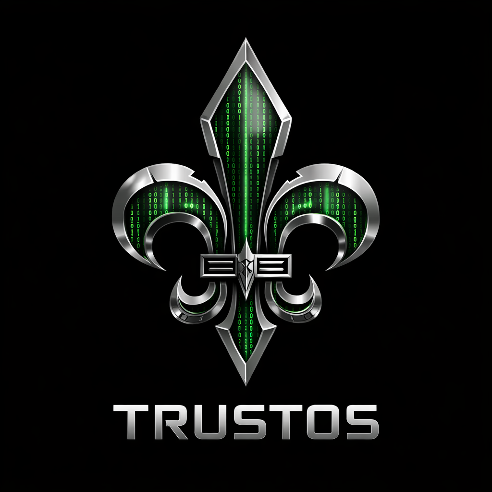
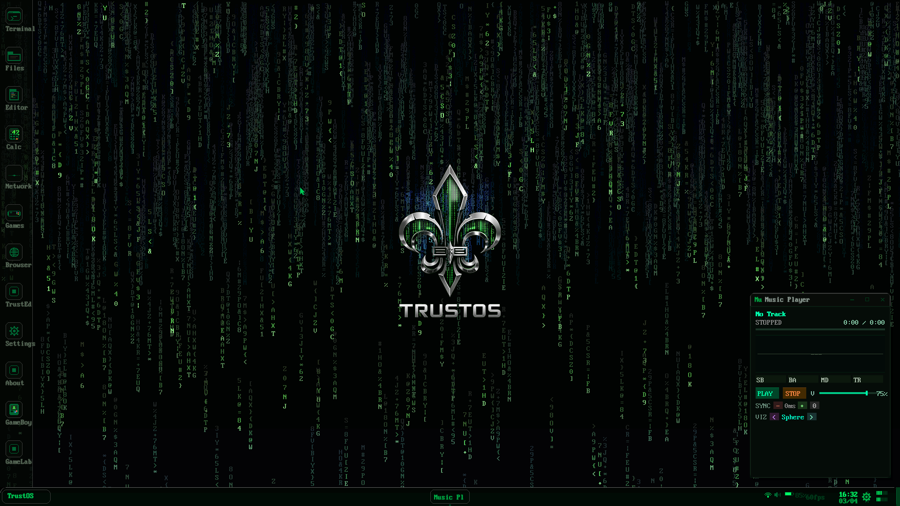

<div align="center">



# TrustOS

### The OS you can actually read — in your language.

**A bare-metal operating system written entirely in Rust — 276,000+ lines, zero C, zero binary blobs, zero secrets.**

*Built by one developer. Auditable by anyone. Learnable in English & French.*

[]()
[]()
[]()
[]()
[]()
[-brightgreen?style=for-the-badge)]()
[]()
[](LICENSE)
[](https://github.com/nathan237)

[](https://youtu.be/RBJJi8jW1_g)



[**Source Code for Developers**](#-source-code-translation-for-developers) | [What's New](#-whats-new-in-v0104) | [Download](#-download) | [Why TrustOS](#-why-trustos) | [Features](#-features) | [Quick Start](#-quick-start) | [Changelog](#-changelog)

---

</div>

## 🌍 Source Code Translation for Developers

> **New in v0.10.4** — TrustOS ships its entire source code in **4 developer-friendly versions**, auto-generated from one canonical codebase.

Every `.rs` file in `kernel/src/` (480+ files, 276K+ lines) is automatically translated into 4 presets — each one compiles, each one is a valid representation of TrustOS:

| Version | What it does | Who it's for |
|---------|-------------|-------------|
| **`translated/original/`** | Exact copy of the real source | Reference / diff baseline |
| **`translated/minimal/`** | All comments stripped, identifiers shortened to minimal names (`buf` → `b`) | Study pure code structure without noise |
| **`translated/educational-en/`** | Abbreviations expanded (`buf` → `buffer`, `ctx` → `context`, `irq` → `interrupt_request`) + inline English annotations on every `unsafe`, `static`, `impl`, `trait`, `enum`, `#![no_std]`… | **Learn Rust & OS dev in English** |
| **`translated/educational-fr/`** | Same expansions + **French annotations** on every Rust pattern | **Apprendre Rust & l'OS dev en français** |

### How it works

A custom **tokenizer-based Rust source translator** ([`tools/source_translator.py`](tools/source_translator.py), 1,500+ lines) parses every token, detects renameable identifiers vs. protected positions (keywords, `.field` access, `asm!()` blocks, FFI, external crate paths…), and applies preset-specific transformations while guaranteeing the output compiles.

```powershell
# Generate all 4 versions in one command:
.\trustos.ps1 translate

# Or generate a single version:
.\trustos.ps1 translate -Only educational-en

# Direct Python usage:
python tools/source_translator.py --preset educational --lang fr -i kernel/src/ -o translated/educational-fr/
```

Every `translated/*/` folder includes a `mapping.json` with thousands of identifier mappings — fully deterministic, reloadable, and diffable.

> **Why this matters:** TrustOS is 276K+ lines of bare-metal Rust. The educational versions turn it into the largest annotated Rust OS learning resource that exists — in two languages.

## 🆕 What's New in v0.10.4

> **March 18, 2026** — Universal Hardware Debugger Expansion (+4,650 lines, 6 new modules)

TrustOS is now a **full hardware diagnostic OS**. PXE-boot or USB-boot on any machine, run `hwdbg auto`, get a complete hardware identity & health report.

- 🔬 **SMBIOS/DMI parser** (`hwdbg smbios`) — Scans memory for SMBIOS 2.x/3.0 entry points. Identifies board, BIOS, chassis, CPU, and every DIMM slot (size, type DDR3/4/5, speed, manufacturer, serial).
- 💽 **ATA SMART reader** (`hwdbg smart`) — Reads SMART health from IDE (PIO) and AHCI (DMA) drives. 50+ known attributes, threshold comparison, pre-failure detection. Temperature, power-on hours, reallocated sectors, pending/uncorrectable.
- 📄 **HTML report generator** (`hwdbg report`) — Self-contained HTML with CSS dark theme. Sections: SMBIOS identity, CPU, DIMM table, PCI devices, SMART health, thermals, EFI, network. Export to USB FAT32 or serial.
- ⚙️ **EFI/UEFI probe** (`hwdbg efi`) — Detects boot mode, Secure Boot, firmware vendor, UEFI version. Works post-ExitBootServices via memory scan.
- 🖵 **EDID display parser** (`hwdbg edid`) — Reads EDID via Intel GMBUS I2C. Identifies monitor manufacturer, model, native resolution, physical size, refresh rate, supported modes.
- 🔋 **ACPI battery & thermal zones** (`hwdbg battery`) — Battery status via EC (ThinkPad + generic), AC adapter detection, 8 EC thermal sensors, MSR CPU/package temps, sleep state detection (S0/S3/S4/S5). Verbose: full 256-byte EC register hex dump.
- 🌐 **MARIONET probe integration** — All new data (SMBIOS, SMART, EFI, battery, thermal zones) available in the MARIONET dashboard auto-collection.
- 🔒 **Hypervisor safety audit** — AMD SVM: all `unwrap()` removed, safe VMCB accessors. VT-x: error handling improvements.
- 🔢 **HwDbg now has 23 subcommands** — up from 17. Run `hwdbg help` for the full list.
- 📈 **276,000+ lines** across 480+ source files, 3 architectures.

---

## 📥 Download

**Grab an ISO and boot it in 30 seconds:**

| Edition | ISO | Size | What's Inside | Download |
|---------|-----|------|---------------|----------|
| **TrustOS** | `trustos.iso` | ~12 MB | Full OS: desktop, networking, emulators, TrustLang, TrustLab, 200+ commands. | [**⬇ Download**](https://github.com/nathan237/TrustOS/releases/latest/download/trustos.iso) |

> **For developers:** The full source code is also available in [**4 translated versions**](#-source-code-translation-for-developers) (original, minimal, educational-en, educational-fr) — clone the repo and explore `translated/`.

```bash
# Boot it right now in QEMU:
qemu-system-x86_64 -cdrom trustos.iso -m 512M -cpu max -smp 4 -display gtk -vga std -serial stdio
```

### 💾 Flash to USB with [Rufus](https://rufus.ie/)

TrustOS runs bare-metal on x86_64 PCs (UEFI or Legacy BIOS), ARM64 phones/tablets, and RISC-V boards. Flash the ISO to a USB drive and boot on real hardware:

<details>
<summary><b>🔹 UEFI Boot (modern PCs, 2012+)</b></summary>

1. Download & open [**Rufus**](https://rufus.ie/) (no install needed)
2. **Device** → select your USB drive
3. **Boot selection** → click **SELECT** → pick `trustos.iso`
4. Rufus will ask: **ISO mode** or **DD Image mode** → pick **DD Image mode**
5. **Click START** — the partition scheme / target system fields stay greyed out in DD mode, that's normal
6. Wait for the write to finish (~30 seconds)
7. Reboot your PC → press **F12** / **F2** / **DEL** at startup to open the boot menu
8. Select your USB drive (it may appear as `UEFI: <USB name>`)
9. TrustOS boots! 🚀

> ⚠️ If your PC has **Secure Boot** enabled, you may need to disable it in BIOS settings first (Security → Secure Boot → Disabled). TrustOS does not use signed bootloaders.

</details>

<details>
<summary><b>🔹 Legacy BIOS Boot (older PCs, pre-2012 or CSM mode)</b></summary>

1. Download & open [**Rufus**](https://rufus.ie/) (no install needed)
2. **Device** → select your USB drive
3. **Boot selection** → click **SELECT** → pick `trustos.iso`
4. Rufus will ask: **ISO mode** or **DD Image mode** → pick **DD Image mode**
5. **Click START** — the partition scheme / target system fields stay greyed out in DD mode, that's normal
6. Wait for the write to finish (~30 seconds)
7. Reboot your PC → press **F12** / **F2** / **DEL** at startup to open the boot menu
8. Select your USB drive (non-UEFI entry, usually just the drive name without `UEFI:` prefix)
9. TrustOS boots via Legacy/CSM! 🚀

> 💡 On some PCs, you need to enable **CSM** (Compatibility Support Module) or **Legacy Boot** in BIOS settings for the Legacy option to appear.

</details>

<details>
<summary><b>🔹 Linux / macOS (dd)</b></summary>

```bash
# Replace /dev/sdX with your USB device (use lsblk to find it)
sudo dd if=trustos.iso of=/dev/sdX bs=4M status=progress conv=fsync
```

</details>

> **Why DD Image mode?** TrustOS uses a hybrid ISO (Limine bootloader) that embeds both UEFI and Legacy BIOS boot sectors directly in the image. DD mode writes the raw image byte-for-byte, preserving both boot paths. ISO mode would reformat the drive and break the hybrid layout.

All releases: [**github.com/nathan237/TrustOS/releases**](https://github.com/nathan237/TrustOS/releases)

---

## 🔑 Why TrustOS?

TrustOS does things that **no other operating system on Earth** does. Here's why you should care:

### ⚡ A native x86_64 compiler running *inside* the OS
TrustLang compiles your programs to **raw Intel machine code** and executes them — all from within the kernel. No LLVM. No GCC. No external toolchain. Write code → native binary → execute. The entire compiler is 3,600 lines of Rust.

### 🔍 276,000 lines — and you can read every single one
No binary blobs. No proprietary drivers. No hidden telemetry. **Every driver, every protocol, every pixel, every encryption algorithm** is open Rust. One developer built it. Anyone can audit it.

### 🌍 Source code that teaches itself — in your language
Every file ships in **4 auto-generated versions**: original, minimal (stripped), educational-en (annotated English), educational-fr (annotated French). A custom tokenizer-based translator expands abbreviations, adds inline explanations of every `unsafe`, `trait`, `impl`, and Rust pattern — turning 276K lines of kernel code into the **largest annotated Rust OS learning resource in existence**.

### 🖥 A real desktop OS, not a toy
144 FPS SIMD-accelerated desktop with 14+ apps, a browser with HTML/CSS/JS, Game Boy and NES emulators, 3D chess, a code editor, network security toolkit, and the most complete kernel introspection lab ever built into a bare-metal OS.

### 🏗 Everything from scratch — zero dependencies
TLS 1.3, TCP/IP, DNS, DHCP, HTTP/HTTPS, FAT32, EXT4, NVMe, AHCI, VirtIO, VT-x/AMD-V hypervisor, Ed25519 signatures, audio synthesizer — all written in pure Rust. Not a single line of C. Not a single external crate.

### 📱 Runs on 3 architectures from one codebase
x86_64 PCs, ARM64 (Android phones, Raspberry Pi), RISC-V — same source, same OS.

### 🌐 Self-replicating over the network
PXE boot a blank machine → TrustOS installs itself, pushes the kernel over TFTP, and brings up identical instances on bare hardware — automatically.

> *"The only OS where you can trace every packet, every pixel, and every keystroke back to its source code — in your language."*

---

## 🏆 Feature Highlights

These are things no other bare-metal OS does:

### 1. Native x86_64 Compiler Running Inside the OS

TrustLang is a full programming language **built into the kernel** — with a lexer, parser, AST compiler, bytecode VM, **and a native x86_64 machine code backend**. You can write a program, compile it to raw Intel instructions, and execute it — all from within TrustOS, with zero external tools.

```
trustlang compile my_app.tl   → Compiles to native x86_64 and executes
trustlang run my_app.tl       → Bytecode VM execution
trustlang bench               → Benchmark native vs VM (shows speedup)
trustlang test                → 55+ automated test suite
```

3,612 lines. Lexer → Parser → AST → Bytecode OR native x86_64. Dual execution backends.

### 2. Self-Replicating Over the Network

TrustOS can PXE boot new machines, push the kernel binary over TFTP, and bring up identical TrustOS instances on bare hardware — automatically. Plug in a blank PC, turn it on, and TrustOS deploys itself.

### 3. Real-Time Kernel Introspection (TrustLab)

A 7-panel interactive lab that lets you watch the kernel at work in real-time: hardware status, kernel trace bus, file system tree, hex editor, TrustLang editor with syntax highlighting, execution pipeline. No other bare-metal OS ships this.

### 4. Everything From Scratch

TLS 1.3, TCP/IP, DNS, DHCP, HTTP, HTML/CSS parser, JavaScript engine, FAT32, EXT4, NVMe, AHCI, VirtIO, Game Boy emulator, NES emulator, 3D renderer, audio synthesizer, Ed25519 signatures, chess AI — all written in Rust, from zero, with no external libraries.

### 5. Source Code Translation for Developers

Every `.rs` file auto-translated into 4 versions (original, minimal, educational-en, educational-fr) by a custom tokenizer-based translator. 480+ files × 4 presets = 1,920+ compilable Rust files. Abbreviations expanded, inline annotations in English or French on every Rust pattern. The entire codebase becomes a learning tool. [**→ Learn more**](#-source-code-translation-for-developers)

---

##  Features

### COSMIC2 Desktop Environment
- Multi-layer GPU compositor: 8 rendering layers, SSE2 SIMD blitting, 144 FPS
- Taskbar, dock, start menu, window manager with 4px chrome borders
- 14+ desktop apps: Terminal, Files, TrustCode, Calculator, Network, Snake, Chess 3D, TrustBrowser, TrustEdit 3D…
- Touch & gesture input for mobile/tablet deployment

### TrustLang — Built-in Programming Language
- Rust-inspired syntax: `fn`, `let`, `mut`, `if/else`, `while`, `for`, `return`, `struct`
- Full pipeline: Lexer → Parser → AST → Compiler → Bytecode VM **+ native x86_64 backend**
- 20 builtin functions: `print`, `pixel`, `fill_rect`, `draw_circle`, `screen_w`, `sleep`…
- REPL, file execution, syntax checker, native benchmark
- 3,612 lines, dual execution mode (interpreted + native)

### Network Stack (all from scratch)
- VirtIO-net driver, TCP/IP (ARP, DHCP, DNS, TCP, UDP, ICMP), IPv6 + ICMPv6
- TLS 1.3 — full handshake, X.509 certificate parsing, all crypto from scratch
- HTTP/HTTPS client + HTTP server (`httpd start/stop/status`)
- Live-tested against real internet (google.com nmap + curl verified)

### TrustScan — Network Security Toolkit
Port scanner, packet sniffer, banner grabber, host discovery, traceroute, vulnerability scanner.

### TrustLab — Kernel Introspection
7-panel interactive workspace: Hardware Status, Kernel Trace, Command Guide, File System Tree, TrustLang Editor, Execution Pipeline, Hex Editor. Zero-cost 512-slot trace bus. Launch: `trustlab`

### Emulators
- **Game Boy Color** — Full CGB: LR35902 CPU, all 501 opcodes, scanline PPU, MBC1/3/5 + GameLab analysis dashboard
- **NES** — MOS 6502 (151 official + 8 unofficial opcodes), 2C02 PPU, mappers 0-3

### Hypervisor & Linux Compatibility
- **Intel VT-x** and **AMD-V** dual-backend with EPT/NPT
- **70+ Linux syscalls**, ELF64 loader, Ring 3 userland, PTY/TTY, job control

### Security & Crypto
- Ed25519 signatures (RFC 8032) — full public-key cryptography
- TLS 1.3 — handshake, AEAD, X.509, all from scratch
- Capability-based security model

### Storage
- **TrustFS** — native bare-metal filesystem with WAL journal, indirect blocks
- **FAT32** — read/write for USB/disk interoperability
- **EXT4** — read-only for Linux compatibility
- **RamFS**, **DevFS**, **ProcFS** — in-memory filesystems
- **Persistence** — raw AHCI sector storage for cross-reboot file survival

### Multi-Architecture

| Target | Arch | Method | Status |
|--------|------|--------|--------|
| PC (USB/ISO) | x86_64 | Limine UEFI + Legacy BIOS (hybrid) | Production |
| Android | ARM64 | `fastboot flash boot` | Ready |
| Raspberry Pi | ARM64 | SD card (kernel8.img) | Ready |
| RISC-V boards | RISC-V | OpenSBI + U-Boot | Ready |
| QEMU (all 3 archs) | x86_64 / ARM64 / RISC-V | Virtual machine | Ready |

---

## 📊 By the Numbers

| | |
|---|---|
| **276,000+ lines** of pure Rust | **96/96** self-tests passing (100%) |
| **480+** source files | **144 FPS** SIMD desktop |
| **3** architectures (x86_64, ARM64, RISC-V) | **< 1 sec** boot time |
| **3,612** lines of TrustLang (dual backend) | **0** lines of C |
| **215+** shell commands (23 hwdbg subcommands) | **0** binary blobs |
| **4** translated source versions (EN/FR) | **1,920+** auto-generated compilable files |
| **14+** desktop applications | **0** external dependencies |

---

## 🚀 Quick Start

### Option A: Download & run (30 seconds)

1. Grab the ISO from [**Releases**](https://github.com/nathan237/TrustOS/releases) (or use the [Download](#-download) links above)
2. Boot it:

```bash
qemu-system-x86_64 -cdrom trustos.iso -m 512M -cpu max -smp 4 -display gtk -vga std -serial stdio
```

> Or flash to USB with **Rufus (DD Image mode)** / `dd` and boot on real hardware.
> Works on both **UEFI** and **Legacy BIOS** machines.

### Option B: Build from source

```powershell
git clone https://github.com/nathan237/TrustOS.git
cd TrustOS

# Build the OS
.\trustos.ps1 build

# Generate all 4 translated source versions
.\trustos.ps1 translate

# Full release (build + translate + tag + push)
.\.trustos.ps1 release -Tag v0.10.4
```

### First commands

| Command | What it does |
|---------|-------------|
| `desktop` | Launch COSMIC2 desktop environment |
| `trustlang demo` | Run TrustLang demo program |
| `trustlang test` | Run 55+ native backend tests |
| `trustlab` | Open kernel introspection lab |
| `showcase` | Automated feature tour |
| `neofetch` | System info |
| `chess3d` | 3D chess vs AI |
| `gameboy` | Game Boy Color emulator |
| `selftest` | Run 96 automated self-tests |
| `help` | All 215+ commands |

### Explore the translated source

```
translated/
  original/          → Exact source copy (reference)
  minimal/           → Stripped identifiers, no comments
  educational-en/    → Expanded names + English annotations
  educational-fr/    → Expanded names + French annotations
```

Each folder contains the full 480+-file kernel — compilable, diffable, and annotated for learning.

---

## 📁 Project Structure

```
TrustOS/
  kernel/                     # Core bare-metal kernel (276K+ lines)
    src/                      # 480+ .rs files
      trustlang/              # TrustLang compiler + native x86_64 (3,612 lines)
      shell/                  # 215+ commands
      desktop.rs              # COSMIC2 desktop manager
      hwdiag/                 # Hardware diagnostics (23 subcommands)
      network/                # TCP/IP, TLS 1.3, DHCP, DNS
      browser/                # HTML/CSS/JS browser engine
      gameboy/                # Game Boy Color emulator
      nes/                    # NES emulator
      hypervisor/             # VT-x/SVM, EPT/NPT
      vfs/                    # TrustFS, FAT32, EXT4, procfs
      tls13/                  # TLS 1.3, crypto, X.509
      netscan/                # Network security toolkit
      drivers/                # AHCI, USB, VirtIO, NVMe, Apple
  translated/                 # Auto-generated source versions
    original/                 # Exact copy (reference)
    minimal/                  # Stripped identifiers, no comments
    educational-en/           # Expanded + English annotations
    educational-fr/           # Expanded + French annotations
  tools/
    source_translator.py      # Tokenizer-based Rust translator (1,500+ lines)
    translate-all.ps1         # Translation orchestrator
  trustos.ps1                 # Unified build shell (build/release/translate/clean/status)
  userland/                   # Userspace programs
  scripts/
    build/                    # Build scripts (limine, multiarch)
    launch/                   # VM launch scripts (QEMU, VBox)
    test/                     # Test automation
  docs/                       # Documentation, roadmaps, guides
  builds/
    trustos/                  # ISO output
  firmware/                   # UEFI firmware (OVMF)
  limine/                     # Bootloader binaries
  apple/                      # iOS security research
  sdk/                        # Cross-compilation SDK
```

---

## 📋 Changelog

### v0.10.4 — Universal Hardware Debugger Expansion (March 18, 2026)

- **SMBIOS/DMI parser** — Scans memory for SMBIOS 2.x/3.0 entry points. Identifies board, BIOS, chassis, CPU, DIMM slots (532 lines).
- **ATA SMART reader** — IDE PIO + AHCI DMA SMART reads. 50+ attributes, threshold comparison, pre-failure detection (543 lines). New AHCI driver functions: `send_smart_command()`, `smart_read_data()`.
- **HTML report generator** — Self-contained HTML with embedded CSS dark theme. SMBIOS, CPU, DIMM table, PCI, SMART, thermals, EFI. USB FAT32 export (280 lines).
- **EFI/UEFI probe** — Boot mode, Secure Boot, firmware vendor, UEFI version. Memory scan for EFI System Table post-ExitBootServices (249 lines).
- **EDID display parser** — Intel GMBUS I2C EDID read. Monitor manufacturer, model, native resolution, physical size, modes (370 lines).
- **ACPI battery & thermal zones** — EC battery (ThinkPad + generic), AC adapter, 8 thermal sensors, MSR temps, sleep states, EC hex dump (351 lines).
- **MARIONET probe integration** — SystemData enriched with SMBIOS, SMART, EFI, battery, thermal zones.
- **Hypervisor safety** — AMD SVM: all `unwrap()` removed. VT-x: error handling improvements.
- **HwDbg: 23 subcommands** — up from 17. New: `smbios`, `smart`, `efi`, `edid`, `battery`, `report`.
- **+4,650 lines** of new hardware diagnostic code. Kernel total: 276K+ lines.

### v0.10.3 — Source Code Translation & ThinkPad Hardware (March 15, 2026)

- **Source Code Translation System** — Custom tokenizer-based Rust translator (`tools/source_translator.py`, 1,500+ lines). Auto-generates 4 versions of the entire kernel source (480+ files): original, minimal, educational-en, educational-fr. Educational versions expand 120+ abbreviations and add inline annotations on every Rust pattern (`unsafe`, `trait`, `impl`, `enum`, `#![no_std]`…). All versions compile. Unified via `.\trustos.ps1 translate`.
- **ThinkPad EC driver** — Embedded Controller communication (ports 0x62/0x66) with IBF/OBF handshake and timeout. 8 temperature sensors, fan level get/set (0-7, auto, full speed, off), fan RPM readout.
- **CPU frequency/voltage** — Intel Enhanced SpeedStep via MSR 0x198/0x199. Read current freq/voltage, set P-states by FID/VID, predefined T61 Core 2 Duo profiles. CPU DTS thermal readout via MSR 0x19C.
- **HDA speaker path** — Fixed critical bug where only the headphone route had `conn_sel` set. Speaker path NID 18→10→4 never received audio. All output paths now fully configured.
- **HDA GPIO1 polarity** — T61 needs GPIO1=HIGH for amp power (not LOW like HP laptops). Confirmed via hardware testing.
- **HDA Amp Param Override** — Per spec 7.3.4.7, use AFG amp caps when widget override bit is clear. AD1984 widgets returned non-zero caps with numsteps=0.
- **Shell scrollback** — Backspace tracking, raw pixel suggestion rendering, auto-snap on restore. Tab autocomplete uses direct pixel clearing to avoid buffer corruption.
- **New commands:** `fan`, `temp`/`sensors`, `cpufreq`/`speedstep`.

### v0.10.1 — Desktop Apps & Shell Polish (March 14, 2026)

- **Settings GUI** — Full settings panel in COSMIC2 desktop: 8 categories with sidebar navigation. Display (resolution info, animations toggle), Sound (volume slider), Taskbar (clock/date/centered icons toggles), Personalization, Accessibility (high contrast toggle), Network, Apps, About.
- **NetScan GUI** — Network security toolkit as a tabbed desktop app: Dashboard overview, Port Scanner, Host Discovery, Packet Sniffer, Traceroute, Vulnerability Scanner. Keyboard-navigable tabs.
- **Shell scrollback fix** — `scroll_down()` now redraws at offset=0 (was a no-op). `redraw_from_scrollback` renders the current uncommitted line at live view. Auto-snap to bottom on any non-PageUp/PageDown keypress. New `restore_live_view()` API.
- **Tab autocomplete cursor fix** — `clear_suggestions_at_row()` left cursor on suggestion rows; Tab/Enter now restore cursor to input row before clearing.
- **ACPI shutdown hardening** — Try QEMU (0x604), Bochs (0xB004), VirtualBox (0x4004), Cloud Hypervisor (0x600) shutdown ports before standard ACPI PM1a multi-type scan.
- **Desktop icon rename** — "Chess 3D" replaces generic "Games".

### v0.10.0 — Real Hardware Stability (March 13, 2026)

- **T61 desktop freeze fixed** — `serial::read_byte()` now checks `SERIAL_PRESENT`; UART noise no longer spins the keyboard loop. Desktop input loop capped at 32 keys/frame.
- **HDA audio on ICH8** — Codec wake timeout 50ms with retry, AD198x/CX205xx quirks, EAPD, proper L+R amp unmute.
- **SIMD/FPU safety** — `fninit` + `ldmxcsr` in `enable_sse()` masks all SIMD/FPU exceptions from dirty BIOS state. New IDT handlers for #NM(7), #SS(12), #MF(16), #XM(19).
- **Fallible buffer allocs** — Double buffer, background cache, GL depth buffer use `try_reserve_exact` (no OOM panic).
- **Diagnostic framework** — Step-by-step visual diagnostics written directly to raw framebuffer for hardware debugging.

### v0.9.6 — T61 Desktop Crash Fix (March 13, 2026)

- **MXCSR/FPU init** — Real hardware BIOS leaves dirty SIMD/FPU state; now clean-initialized.
- **Missing IDT handlers** — Added #NM, #SS, #MF, #XM exception handlers.
- **Fallible framebuffer allocs** — `init_double_buffer` / `init_background_cache` use `try_reserve_exact`.
- **Autocomplete bounds check** — Shell autocomplete no longer panics on edge cases.

### v0.9.5 — Hardware Compatibility Hardening (March 13, 2026)

- **Serial port detection** — Loopback test + write timeout; no-UART systems boot without hangs.
- **APIC timer fallback** — PIT calibration failure → 1000 ticks/ms fallback; timer always starts.
- **4K OOM protection** — Backbuffer capped at 16 MB; 4K+ goes direct framebuffer.
- **BPP validation** — Non-32bpp framebuffers warned and handled gracefully.

### v0.9.4 — Keyboard Stability Fix (March 13, 2026)

- **Deadlock fix** — Keyboard IRQ + shell input buffer lock race eliminated with `without_interrupts` + `try_lock`.
- **Bootstrap guard** — Keyboard IRQ handlers gated behind `BOOTSTRAP_READY` (matches timer handler pattern).
- **i8042 timeout 10x** — 100K → 1M spin iterations for slow PS/2 controllers.
- **Pause/Break key** — E1 prefix (6-byte sequence) properly consumed.
- **Right Ctrl/Alt release tracking** — Extended modifier releases no longer silently dropped.
- **PS/2 response filter** — Added 0xAB to spurious scancode filter.

### v0.9.3 — Taskbar Fix & Framebuffer Cleanup (March 12, 2026)

- **Taskbar tray spacing** — Fixed tray icon overlap.
- **Aura removed** — Cleaned framebuffer effects.

### v0.9.2 — Legacy BIOS Boot & Audio Viz (March 12, 2026)

- **Legacy BIOS boot support** — Hybrid ISO now boots on PCs without UEFI. `limine bios-install`, Rock Ridge `-R -r -J` ISO flags, `limine.conf` + `limine.cfg` dual config.
- **Taskbar overlap fix** — Desktop windows no longer render behind the taskbar.
- **Audio visualizer** — Real-time waveform display in desktop.
- **TrustLang VM improvements** — Better error handling, optimized execution.

### v0.9.1 — Music Player Overhaul (March 12, 2026)

- **TrustPlayer** — New music player with waveform visualizer, playlist, playback controls.
- **Auto-tier fix** — Hardware tier detection corrected.

### v0.9.0 — Boot Fix, Transparent Logo, Chrome Browser (March 12, 2026)

- **Fix boot ALLOC ERROR crash** — CHECKPOINTS and BOOT_MEMORY_MAP replaced with fixed-size arrays (no heap before allocator init).
- **Fix build pipeline** — xorriso stderr no longer kills PowerShell script.
- **Transparent logo** — Logo renders over matrix rain (luminance threshold skip).
- **Chrome-style browser** — Tab bar, omnibox, rounded buttons, lock icon, 3-dot menu.
- **File manager** — Details/Tiles views, sidebar, search, column sorting.
- 30 files changed, ~5500 insertions, ~570 deletions.

### v0.8.0 — Native Compiler & Desktop Polish (March 12, 2026)

- **TrustLang native x86_64 backend** — compile `.tl` programs directly to Intel machine code and execute in-kernel. Dual execution: bytecode VM + native. 55+ automated tests + cross-validation + benchmarking.
- **x86_64 assembler module** (`x86asm.rs`) — full instruction emitter: MOV, ADD, SUB, IMUL, IDIV, CMP, Jcc, SETcc, CALL, RET, function prologue/epilogue.
- **Desktop border refinement** — window borders thickened to 4px for a bolder, more modern look.
- **Shell commands**: `trustlang compile`, `trustlang test`, `trustlang bench`.
- **Selftest integration** — native compiler smoke test added to the 96-test diagnostic suite.

### v0.7.0 — checkm8 & Multi-Edition (March 2026)

- **Project reorganization**: root cleaned from 400+ files to 11.
- **On-device AI engine** — 4.4M-parameter transformer architecture (work in progress).
- **checkm8 SecureROM exploit** — bare-metal xHCI USB exploit for Apple A12 DFU mode.
- **Apple hardware drivers** — AIC + UART for native Apple silicon.
- **ARM64 GICv2** — full interrupt controller + exception vectors.
- **COSMIC2 Desktop refresh** — redesigned windows, transparency, icons.

### v0.6.0 — Multi-Arch & Universal Boot (February 2026)

- Multi-Architecture: x86_64, aarch64, riscv64 from one codebase.
- Android boot: boot.img v2 pipeline, `fastboot flash boot`.
- Raspberry Pi SD: bare-metal RPi 4/5.
- Universal installer: 9 targets, one script.
- Touch & gesture input.

### v0.5.0 — CyberLab (February 2026)

- Live network scan verified on google.com — 11/11 tests passed.
- Code optimization (−2,800 lines).
- 95/96 auto-tests (99%).

### v0.4.x — Emulators & GameLab (February 2026)

- Game Boy Color emulator — full CGB: LR35902, scanline PPU, MBC1/3/5.
- GameLab — 2,000-line analysis dashboard.
- NES emulator — 6502 CPU, 2C02 PPU, mappers 0-3.
- Shell scripting, HTTP server, TrustPkg, TrustScan, IPv6.

### v0.3.x — Foundation (February 2026)

- ACPI, PIC, PIT, RTC, PTY/TTY, job control, NVMe swap, SMP.

### v0.2.0 — Userspace (February 2026)

- Ring 3 execution, ELF64 loader, TrustFS.

### v0.1.x — Initial Development (February 2026)

- TrustLab, COSMIC2 desktop, Ed25519, 3D Chess, audio synth, web sandbox.

---

## 📖 Documentation

| Document | Location |
|----------|----------|
| Developer Guide | [`docs/DEVELOPER_GUIDE.md`](docs/DEVELOPER_GUIDE.md) |
| Contributing | [`docs/CONTRIBUTING.md`](docs/CONTRIBUTING.md) |
| Roadmap | [`docs/ROADMAP_V2.md`](docs/ROADMAP_V2.md) |
| Release Notes | [`docs/RELEASE_NOTES.md`](docs/RELEASE_NOTES.md) |
| Command Reference | [`docs/TRUSTOS_COMPLETE_COMMAND_REFERENCE.md`](docs/TRUSTOS_COMPLETE_COMMAND_REFERENCE.md) |
| Source Translator | [`tools/source_translator.py`](tools/source_translator.py) |
| Translated Source (EN) | [`translated/educational-en/`](translated/educational-en/) |
| Translated Source (FR) | [`translated/educational-fr/`](translated/educational-fr/) |

---

## 🤝 Contributing

Contributions welcome. TrustOS is designed to be readable and hackable.

> See [`docs/CONTRIBUTING.md`](docs/CONTRIBUTING.md) for the full guide.

```bash
git clone https://github.com/YOUR_USERNAME/TrustOS.git
git checkout -b feature/my-feature
cargo build --release -p trustos_kernel
# Test in QEMU, then open a Pull Request
```

---

## 🤖 AI Disclosure

This project is built using **GitHub Copilot (Claude)** in VS Code agent mode. The AI generates the majority of the code from my prompts and architectural decisions. I design, direct, debug on real hardware, and review the output. This is a solo learning/experimental project, not production software.

---

## 📄 License

Apache License 2.0 — see [LICENSE](LICENSE).

---

## 👤 Author

**Nated0ge** — Sole creator & developer of TrustOS

- GitHub: [@nathan237](https://github.com/nathan237)
- Project: [TrustOS](https://github.com/nathan237/TrustOS)

---

<div align="center">

**Trust** the code. **Rust** is the reason.

Created by [Nated0ge](https://github.com/nathan237) — March 2026

276,000+ lines | Native x86_64 compiler | 3 architectures | 4 translated source versions | Everything from scratch | Zero C

[Report Bug](https://github.com/nathan237/TrustOS/issues) | [Request Feature](https://github.com/nathan237/TrustOS/issues) | [Watch Demo](https://youtu.be/RBJJi8jW1_g)

</div>
